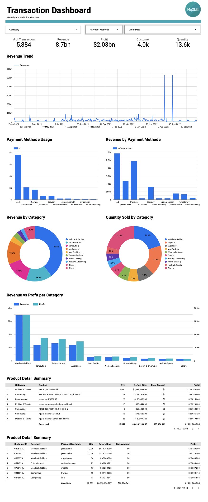

# E-Commerce Transaction Dashboard Analysis

This project analyzes e-commerce transaction data to understand sales performance, customer behavior, and revenue trends through an interactive dashboard.

---

## Business Problem
How can we monitor transaction performance, revenue trends, and customer behavior to support better business decision-making?

---

## Dataset
- Source: E-commerce transaction dataset (MySkill project)  
- Data includes: transactions, revenue, profit, customer, product category, payment method, and order date  
- Total Transactions: 5,884  
- Total Revenue: 8.7 Billion  
- Total Customers: 4,000+  
- Total Quantity Sold: 13,559  

---

## Tools
- Looker Studio (Dashboard)  
- SQL / Excel (data preparation)  

---

## Process
- Cleaned and validated transaction data  
- Aggregated key metrics (Revenue, Profit, Quantity, Customers)  
- Analyzed performance by:
  - Time (trend)  
  - Category  
  - Payment method  
- Built interactive dashboard with filters for category, payment method, and date  

---

## Key Metrics
- Total Transactions: 5,884  
- Total Revenue: 8.7 Billion  
- Total Profit: 2.03 Billion  
- Total Customers: 4,000+  

---

## Key Insights
- Revenue is highly concentrated in **Mobiles & Tablets**, contributing the largest share of total sales  
- Payment method **Cash on Delivery (COD)** dominates both usage and revenue contribution  
- Revenue shows fluctuating trends with several spikes, indicating irregular purchasing patterns  
- A small number of products contribute disproportionately high revenue (top products dominate sales)  
- Some categories generate high revenue but relatively lower profit, indicating margin inefficiencies  

---

## Recommendations
- Diversify product focus to reduce dependency on a single high-performing category  
- Encourage digital payment methods to reduce reliance on COD  
- Analyze peak sales periods to identify successful campaigns or seasonal patterns  
- Optimize pricing and cost strategies for categories with lower profit margins  
- Focus marketing and inventory on top-performing products  

---

## Dashboard Preview

---

## Author
Ahmad Iqbal Maulana
