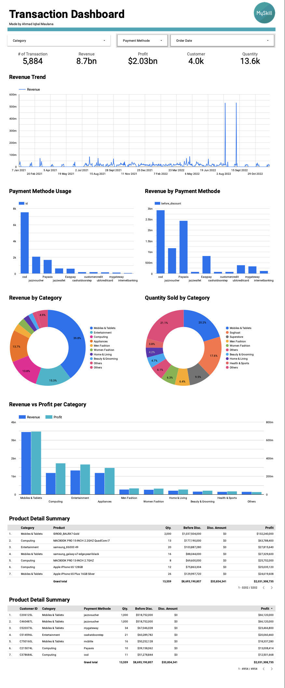

# E-Commerce Transaction Dashboard Analysis

This project analyzes e-commerce transaction data to evaluate sales performance, customer behavior, and revenue trends. The goal is to generate actionable insights to support data-driven business decision-making.

---

## Live Dashboard
[View Interactive Dashboard](https://datastudio.google.com/reporting/e3d5a161-156b-4b85-882e-77597fc1b11b)

---

## Business Problem
How can we monitor transaction performance, revenue trends, and customer behavior to support better business decision-making?

---

## Dataset
- Source: E-commerce transaction dataset (MySkill project)  
- Data includes: transactions, revenue, profit, customer, product category, payment method, and order date  
- Total Transactions: 5,884  
- Total Revenue: 8.7 Billion  
- Total Customers: 4,000+  
- Total Quantity Sold: 13,559  

---

## Tools
- Looker Studio (Dashboard)  
- SQL / Excel (data preparation)  

---

## Process
- Cleaned and validated transaction data  
- Aggregated key metrics (Revenue, Profit, Quantity, Customers)  
- Performed multidimensional analysis by Time, Category, and Payment Method  
- Built an interactive dashboard with interactive filters for category, payment, and date  

---

## Key Metrics
- Total Transactions: 5,884  
- Total Revenue: 8.7 Billion  
- Total Profit: 2.03 Billion  
- Total Customers: 4,000+  

---

## Key Insights

Advanced commercial and operational insights extracted from the Looker Studio transaction monitoring dashboard (Portfolio size: 5,884 transactions yielding R$8.7B gross revenue):

* **Severe Category Concentration Risk:** Revenue generation is disproportionately anchored in the **Mobiles & Tablets** vertical. While it successfully drives massive top-line volume, this extreme structural reliance exposes the marketplace to high vulnerability from tech-hardware lifecycle shifts and intense competitor pricing wars.
* **Working Capital Lock-up via COD Dominance:** The **Cash on Delivery (COD)** payment method dominates both transaction volume and revenue contribution. This high dependency increases operational risk (elevated Return-to-Origin / RTO rates) and creates a cash-flow lag compared to instant digital settlements.
* **Margin Compression Inefficiencies:** Granular profit pool mapping reveals that a small subset of product lines accounts for the vast majority of gross value. Conversely, several high-revenue categories yield disproportionately compressed profit margins, signaling bloated cost of goods sold (COGS) or unoptimized vendor pricing structures.
* **Volatile Baseline Demand:** The historical revenue line reveals irregular transaction spikes rather than steady baseline customer retention. This indicates that marketplace expansion is heavily dependent on temporary promotion-driven bursts rather than organic customer lifetime value (LTV).

---

## Strategic Recommendations

Actionable, data-backed playbooks designed for the Commercial and Product Management teams to stabilize cash flow and optimize profit margins:

* **De-risk Portfolio Dependency via High-Margin Bundling:** Mitigate the extreme reliance on Mobiles & Tablets by introducing multi-category product bundles. Pair high-volume electronics with high-margin accessories or underperforming categories to balance gross margins across the platform.
* **Execute Digital Payment Migration Incentives:** Reduce the operational hazards of COD dominance by introducing tactical checkout incentives (e.g., immediate 2-3% discounts or free shipping vouchers) exclusively for users migrating to secure digital wallets or instant bank transfers.
* **Implement Dynamic Value-Based Pricing:** Conduct a comprehensive margin audit on categories showing high revenue but low profit yields. Restructure B2B vendor commission tiers or execute programmatic price adjustments to actively defend the 2.03 Billion profit pipeline.
* **Align Marketing Spend with Pareto Performers:** Shift digital acquisition budgets away from slow-moving inventory to double down on the high-conversion product core that generates the majority of sales, optimizing warehouse turnaround times.

---

## Potential Business Impact

* **Transition to Macro-Level Health Tracking:** Replaced chaotic flat-file reporting with a centralized Looker Studio transaction control tower, shifting management focus from simple revenue observation to active margin protection and cash flow optimization.
* **Data-Backed Commercial Steering:** Provided corporate stakeholders with clear, measurable data evidence to strategically transform payment methods, address category margin leakages, and stabilize seasonal sales volatility.

---

## Dashboard Preview

---

## Author
Ahmad Iqbal Maulana - Data Analyst
